[[section-system-scope-and-context]]
== Kontextabgrenzung

=== Inhalt
Die Kontextabgrenzung für das Projekt FLOW grenzt das System gegen alle Kommunikationspartner (Nachbarsysteme und Benutzerrollen) ab. Im Falle von FLOW sind die Kommunikationspartner hauptsächlich die Hardwarekomponenten und der Endbenutzer.

=== Fachlicher Kontext
Eingaben: Der Benutzer interagiert mit dem System durch das Drücken von Tasten, um die Edges auszuwählen.
Ausgaben: Das System gibt dem Benutzer visuelles Feedback durch LED-Leuchten, die den Zustand der Nodes und Edges repräsentieren.

=== Technischer Kontext

Kanäle: I2C-Kommunikation zwischen dem Raspberry Pi 4 und den Hardwarekomponenten (LEDs und Buttons).
Protokolle: I2C-Kommunikationsprotokoll zur Steuerung von Hardwarekomponenten.
Hardware: Raspberry Pi 4, I2C-Komponenten (TCA9548a), LED-Leuchten, Plexiglasröhren, Buttons.

=== Motivation
Die fachlichen und technischen Schnittstellen zur Kommunikation gehören zu den kritischsten Aspekten eines Systems. Für das Projekt FLOW ist es wichtig, diese Schnittstellen vollständig zu verstehen, um eine reibungslose Interaktion zwischen den Hardwarekomponenten und dem Endbenutzer zu gewährleisten.

=== Form

. Der "Endbenutzer" interagiert mit den "Hardwarekomponenten" durch Eingaben (Buttons) und erhält Ausgaben (LED-Leuchten). Die Kommunikation erfolgt über das I2C-Kommunikationsprotokoll mit dem Raspberry Pi über den I2C Multiplexer und das Gravity Board.
. Die "Applikation" steuert die LEDs und fragt die Buttons ab. Sie kommuniziert auch über das I2C-Kommunikationsprotokoll

===== Listen von Kommunikationsbeziehungen mit deren Schnittstellen

.Endbenutzer <--> Hardwarekomponenten

* Fachliche Schnittstellen
** Eingaben (Buttons)
** Ausgaben (LED-Leuchten)
* Technische Schnittstellen
** I2C-Kommunikation zu Raspberry PI über:
*** I2C Multiplexer
*** Gravity Board

.Applikation <--> Hardwarekomponenten

* Fachliche Schnittstellen:
** Steuerung der LEDs
** Abfrage der Buttons
* Technische Schnittstellen
** I2C-Kommunikation
** Hardware Komponenten-Kompatibilität

////
[role="arc42help"]
****
.Inhalt
Die Kontextabgrenzung grenzt das System gegen alle Kommunikationspartner (Nachbarsysteme und Benutzerrollen) ab.
Sie legt damit die externen Schnittstellen fest und zeigt damit auch die Verantwortlichkeit (scope) Ihres Systems: Welche Verantwortung trägt das System und welche Verantwortung übernehmen die Nachbarsysteme?

Differenzieren Sie fachlichen (Ein- und Ausgaben) und technischen Kontext (Kanäle, Protokolle, Hardware), falls nötig.

.Motivation
Die fachlichen und technischen Schnittstellen zur Kommunikation gehören zu den kritischsten Aspekten eines Systems.
Stellen Sie sicher, dass Sie diese komplett verstanden haben.

.Form
Verschiedene Optionen:

* Diverse Kontextdiagramme
* Listen von Kommunikationsbeziehungen mit deren Schnittstellen

.Weiterführende Informationen

Siehe https://docs.arc42.org/section-3/[Kontextabgrenzung] in der online-Dokumentation (auf Englisch!).

****

=== Fachlicher Kontext

[role="arc42help"]
****
.Inhalt
Festlegung *aller* Kommunikationsbeziehungen (Nutzer, IT-Systeme, ...) mit Erklärung der fachlichen Ein- und Ausgabedaten oder Schnittstellen.
Zusätzlich (bei Bedarf) fachliche Datenformate oder Protokolle der Kommunikation mit den Nachbarsystemen.

.Motivation
Alle Beteiligten müssen verstehen, welche fachlichen Informationen mit der Umwelt ausgetauscht werden.

.Form
Alle Diagrammarten, die das System als Blackbox darstellen und die fachlichen Schnittstellen zu den Nachbarsystemen beschreiben.

Alternativ oder ergänzend können Sie eine Tabelle verwenden.
Der Titel gibt den Namen Ihres Systems wieder; die drei Spalten sind: Kommunikationsbeziehung, Eingabe, Ausgabe.
****

**<Diagramm und/oder Tabelle>**

**<optional: Erläuterung der externen fachlichen Schnittstellen>**

=== Technischer Kontext

[role="arc42help"]
****
.Inhalt
Technische Schnittstellen (Kanäle, Übertragungsmedien) zwischen dem System und seiner Umwelt.
Zusätzlich eine Erklärung (_mapping_), welche fachlichen Ein- und Ausgaben über welche technischen Kanäle fließen.

.Motivation
Viele Stakeholder treffen Architekturentscheidungen auf Basis der technischen Schnittstellen des Systems zu seinem Kontext.

Insbesondere bei der Entwicklung von Infrastruktur oder Hardware sind diese technischen Schnittstellen durchaus entscheidend.

.Form
Beispielsweise UML Deployment-Diagramme mit den Kanälen zu Nachbarsystemen, begleitet von einer Tabelle, die Kanäle auf Ein-/Ausgaben abbildet.
****

**<Diagramm oder Tabelle>**

**<optional: Erläuterung der externen technischen Schnittstellen>**

**<Mapping fachliche auf technische Schnittstellen>**
////