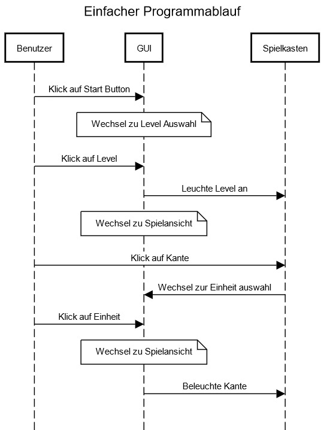

[[section-runtime-view]]
== Laufzeitsicht

In der Lauftzeitsicht wird eine logische Abfolgung der einzelnen Beziehungen und Bausteinen betrachtet.

==== Einfacher Spielablauf

* Start des Spiels:
Der Spielablauf beginnt, wenn der Benutzer den Start-Button drückt. Das System erkennt diese Interaktion und leitet die Initialisierung der Spielsitzung ein.

* Auswahl der Edges:
Nach dem Start des Spiels kann der Benutzer die Tasten drücken, um die Edges auszuwählen. Jeder Tastendruck wird vom System erkannt und die entsprechende Edge wird ausgewählt.

* Bestätigung der Auswahl:
Nachdem der Benutzer seine Auswahl getroffen hat, drückt er den Bestätigungs-Button. Das System erkennt den Tastendruck und bestätigt die Auswahl der Edges.

* Visuelles Feedback:
Nach Bestätigung der Auswahl gibt das System visuelles Feedback durch das Aufleuchten der LED-Leuchten, die den ausgewählten Edges entsprechen.

* Ende des Spiels:
Das Spiel endet entweder nach Ablauf einer bestimmten Zeit oder wenn der Benutzer den Stop-Button drückt. Das System erkennt das Spielende und schaltet alle LED-Leuchten aus.

////
[role="arc42help"]
.Inhalt
Diese Sicht erklärt konkrete Abläufe und Beziehungen zwischen Bausteinen in Form von Szenarien aus den folgenden Bereichen:

*  Wichtige Abläufe oder _Features_:
Wie führen die Bausteine der Architektur die wichtigsten Abläufe durch?
*  Interaktionen an kritischen externen Schnittstellen:
Wie arbeiten Bausteine mit Nutzern und Nachbarsystemen zusammen?
* Betrieb und Administration: Inbetriebnahme, Start, Stop.
* Fehler- und Ausnahmeszenarien

Anmerkung:
Das Kriterium für die Auswahl der möglichen Szenarien (d.h. Abläufe) des Systems ist deren Architekturrelevanz.
Es geht nicht darum, möglichst viele Abläufe darzustellen, sondern eine angemessene Auswahl zu dokumentieren.

.Motivation
Sie sollten verstehen, wie (Instanzen von) Bausteine(n) Ihres Systems ihre jeweiligen Aufgaben erfüllen und zur Laufzeit miteinander kommunizieren.

Nutzen Sie diese Szenarien in der Dokumentation hauptsächlich für eine verständlichere Kommunikation mit denjenigen Stakeholdern, die die statischen Modelle (z.B. Bausteinsicht, Verteilungssicht) weniger verständlich finden.

.Form
Für die Beschreibung von Szenarien gibt es zahlreiche Ausdrucksmöglichkeiten.
Nutzen Sie beispielsweise:

* Nummerierte Schrittfolgen oder Aufzählungen in Umgangssprache
* Aktivitäts- oder Flussdiagramme
* Sequenzdiagramme
* BPMN (Geschäftsprozessmodell und -notation) oder EPKs (Ereignis-Prozessketten)
* Zustandsautomaten
* ...

.Weiterführende Informationen

Siehe https://docs.arc42.org/section-6/[Laufzeitsicht] in der online-Dokumentation (auf Englisch!).

****

=== _<Bezeichnung Laufzeitszenario 1>_

*  <hier Laufzeitdiagramm oder Ablaufbeschreibung einfügen>
*  <hier Besonderheiten bei dem Zusammenspiel der Bausteine in diesem Szenario erläutern>

=== _<Bezeichnung Laufzeitszenario 2>_

...

=== _<Bezeichnung Laufzeitszenario n>_

...
