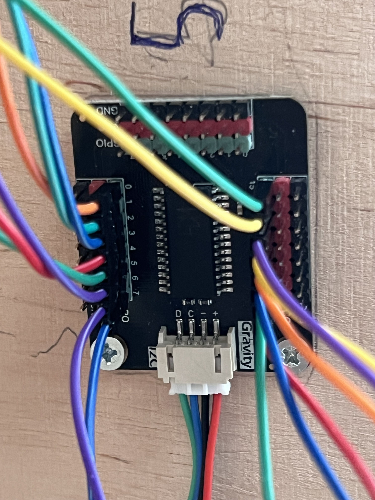
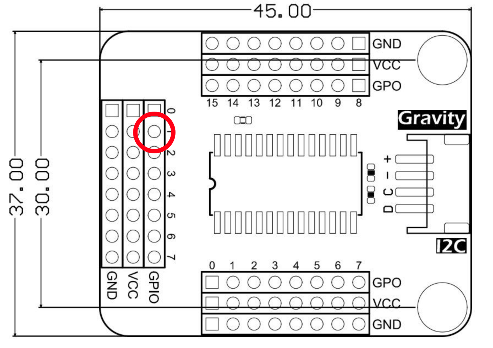
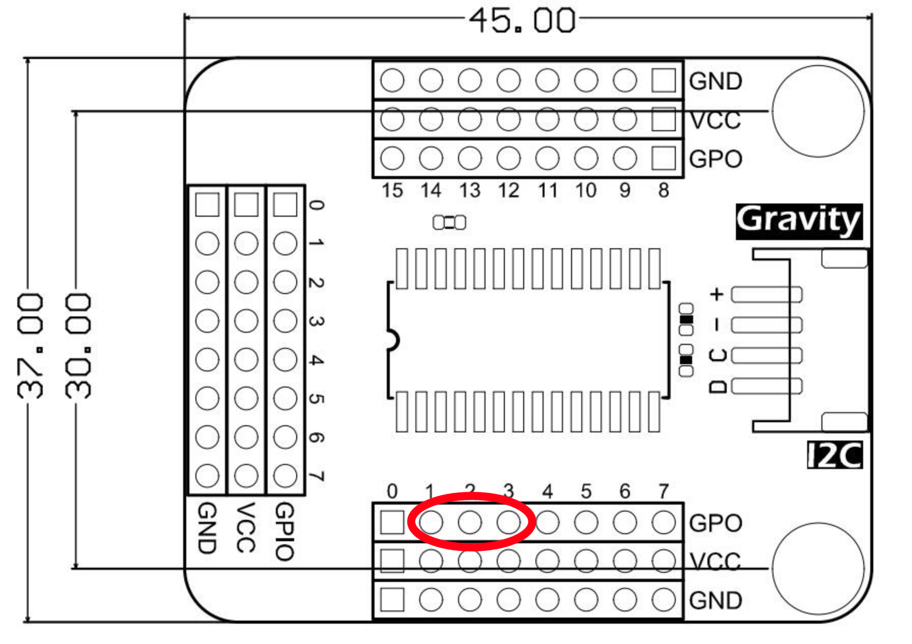
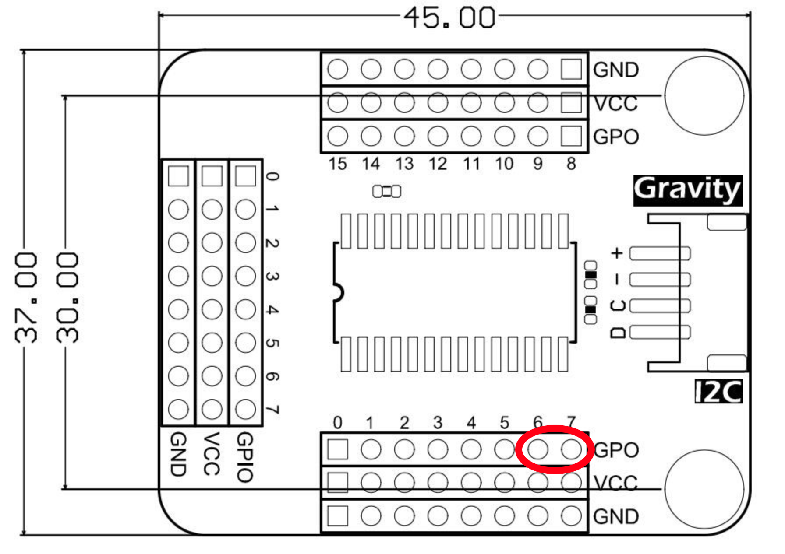
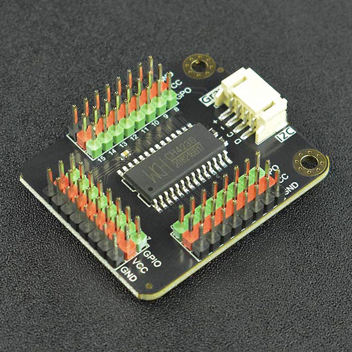

[[section-deployment-view]]
== Verteilungssicht

=== Komponenten
System: Die Applikation wird lokal auf einem Raspberry Pi 4 ausgeführt, der vor Ort beim Benutzer installiert ist. Die Ausführungsumgebung besteht aus dem Betriebssystem Raspberry Pi OS.
Der Hauptrechner ist der Raspberry Pi 4, ein Einplatinencomputer mit einem ARM Cortex-A72 Quad-Core-Prozessor.

Kanäle: Die Kommunikation zwischen dem Raspberry Pi 4 und den Hardwarekomponenten erfolgt über I2C-Verbindungen und GPIO-Pins.

Sonstige Bestandteile:

- RG/RGB LEDs: Verwendet für die Visualisierung von Nodes/Edges.
- Plexiglasstäbe: LED-Röhren, die Edges darstellen.
- GPIO Extension Board: Erweitert die Anzahl der verfügbaren GPIO-Pins auf dem Raspberry Pi 4.
- TCA9548a I2C-Multiplexer: Der TCA9548a ermöglicht es mehrere Busse zu verwenden und bis zu 8 I2C-Geräte über einen I2C-Bus zu steuern.
- CH423 IO Expansion Board: Ermöglicht die Nutzung von zusätzlichen GPIO-Pins über den I2C-Bus.

=== Vorinstallationen
Link für das ursprünglich übernommene Setup: https://pi4j.com/getting-started/set-up-a-new-raspberry-pi/
[%linebreak]
JDK und I2C Konfigurationsänderungen sind im Link nicht enthalten.

- Raspberry Pi OS (früher Raspbian) von der offiziellen WebsiteImage auf eine Micro-SD-Karte laden mit Tool Raspberry Pi Imager.
- Micro-SD-Karte mit Tastatur, Maus, HDMI-Kabel, Ethernet-Kabel verbinden und schliesslich das Stromkabel an dem Raspberry Pi anschliessen.
- Raspberry Pi einschalten und warten bis das Raspberry Pi OS gestartet ist.
- Einrichtungsassistenten ausführen, um die Sprache, Zeitzone, Tastaturbelegung und Netzwerkverbindung einzustellen.
- Installiere Bellsoft Liberica full jdk 17 (https://bell-sw.com/pages/downloads/) auf dem Raspberry pi.
- Tool "raspi-config" verwenden, um Einstellungen anzupassen: Ausführen des Befehls "sudo raspi-config"
. Pfeiltasten verwenden, um zu "Interfacing Options" oder "Schnittstellenoptionen" zu navigieren und Enter betätigen.
. Navigation zu "I2C" und Enter drücken.
. Nach Frage ob ARM I2C-Schnittstelle aktivieren werden sollte, "Ja" auswählen und Enter drücken.
. Anschliessen von Maus und Tastatur über den USB-A Anschluss des Raspberry Pi 4
. Bedienen des Raspberry Pi über Maus und Tastatur
. Starten des Programms "Terminal"
. Ausführen des Befehls: "cd /opt/flow". Nun befindet sich man im Verzeichnis des Projekts.
. Das Projekt muss nun geklont werden: "git clone <git-repo-clone-url>".

=== Deployment

==== Hardwaresetup
Der physische Spielkasten enthält alle Hardware-Komponenten des Produkts "FLOW"
Folgende Schritte sind nötig, um die Hardware startbereit zu bringen:

- Das daran verbundene Stromkabel muss an einer Steckdose (Typ J) angeschlossen werden.
- Die Switch an dem Stromkabel muss betätigt werden.

Nun hat das Produkt ausreichend Strom um zu funktionieren.

==== Softwaresetup
Um das Softwaresetup auszuführen wird das Hardwaresetup vorausgesetzt.
Die Software wird mithilfe maven gestartet.
Um die Applikation erfolgreich zu starten, werden folgende Schritte benötigt:

- Anschliessen von Maus und Tastatur über den USB-A Anschluss des Raspberry Pi 4
- Bedienen des Raspberry Pi über Maus und Tastatur
- Starten des Programms "Terminal"
- Ausführen des Befehls: "cd /opt/flow". Nun befindet sich man im Verzeichnis des Projekts.
- Ausführen des Befehls: "export DISPLAY=:0 && xhost local:root && sudo mvn clean javafx:run" im Verzeichnis des Projekts.

=== Wartung
Um die Wartung zu vereinfachen, können viele Komponenten einfach ausgetauscht werden. Lötkenntnisse sind Voraussetzung,
um die Kabel korrekt zu verbinden. +

Alle Knöpfe und LED haben auf der Unterseite des Baukastens eine Nummer, in welchen Steckplatz sie gehören. Die Nummer ist wie folgt aufgebaut: +
[options="header"]
|===
| Komponent | Aufbau
| Knöpfe | a/b/c
| RG LED | a/b/c,d
| RGB LED | a/b/c,d,e
|===

[options="header"]
|=====================
|Nummer | Bedeutung
| a | Nummer des I2C GPIO Expanders
| b | 0 -> GPO Slot, 1 -> GPIO Slot
| c,d,e | Nummer des Slots
|=====================
Wobei bei einer RG LED bei c der rote Channel und d der grüne Channel ist. Bei einer RGB LED ist c der rote Channel, d der grüne Channel und e der blaue Channel. +

Die I2C GPIO Expander sehen wie folgt aus und ihre Nummerierung ist neben dem Expander zu finden. Hier ist der Expander Nr. 5 abgebildet: +

z.B. 1/0/1 bedeutet, dass der Knopf am ersten I2C GPIO Expander im GPIO Slot 1 steckt. +
oder: 2/1/3,4 bedeutet, dass die LED am zweiten I2C GPO Expander im GPO Slot 3 und 4 steckt.

==== Knöpfe
Knöpfe haben zwei Ground Kabel, welche mit anderen Ground Kabeln von Knöpfen verlötet sind. Das andere Kabel ist in einem I2C GPIO Expander im GPIO Channel eingesteckt.
Das eine Ende des Grounds ist in einem beliebigen GND Pin eingesteckt, das andere Ende ist isoliert an den Holzkasten geklebt. +

Um einen Button zu ersetzen, muss zuerst das Kabel vom I2C GPIO Expander ausgesteckt werden, und die Groundkabel mithilfe eines Lötstabes trennen.
Der Button ist mit Sekundenkleber festgeklebt und kann somit vom Brett gelöst werden. Es ist zwingend notwendig, dass die Steckplätze der LED unverändert bleiben.
Es ist zwingend notwendig, dass die Steckplätze der Knöpfe unverändert bleiben.+
Der Arbeitsaufwand für das Ersetzten von 1 Button wird auf 45min geschätzt.

==== Kanten LED (RGB LED)
Damit sind die LEDs gemeint, welche die Plexiglas Stäbe beleuchten.
Für die Verkabelung wurden verschiedene Farben benutzt: +
- Rot/Orange -> Rote LED +
- Grün/Gelb -> Grüne LED +
- Blau/Violett -> Blaue LED +
- Schwarz/Grau/Weiss/Braun -> Ground +
Die RGB Kabel sind im I2C GPIO Expander in den GPO Pins eingesteckt.

Um die LED zu entfernen, müssen die Kabel auf dem I2C GPIO Expander ausgesteckt werden. Dann den Deckel des 3D Gehäuses entfernen und die LED nach unten drücken.
Zu empfehlen ist, die LED mit einem Holz- oder Plastikstäbchen runter zu drücken +
Der Arbeitsaufwand wird auf 1h geschätzt.

==== Knotenpunkt LED (RG LED)
Damit sind die LEDs gemeint, welche neben den Häusern in der grauen 3D gedruckten Halterung sind.
Die Verkabelung ist wie folgt gekennzeichnet: +
- Mit Isolierband markiert -> Gelb +
- Kabel mit gelötetem Ende -> Ground +
- Übriges Kabel -> Rot +

Um die LED zu entfernen, ist es von Vorteil, die 3D Halterung ebenfalls abzulösen. Diese ist mit Sekundenkleber festgeklebt. Alternativ kann auch die Verkabelung auf der Unterseite von der LED gelöst werden und versucht werden, die LED aus der 3D gedruckten Halterung zu entfernen.
Es ist zwingend notwendig, dass die Steckplätze der LED unverändert bleiben. +
Der Arbeitsaufwand wird auf 1h geschätzt.

==== I2C GPIO Expander
Die I2C GPIO Expander sind mit zwei Schrauben an der Holzplatte befestigt. Diese müssen gelöst werden, damit die Expander entfernt werden können. +
Die Kabel können am weissen Steckplatz des Expanders entfernt werden, somit muss nicht die ganze Verkabelung neu gelegt werden. +

Es ist essenziell, dass alle LEDs und Buttons an den gleichen Steckplätzen bleiben, dafür kann die Nummerierung der Steckplätze auf der Unterseite des Holzkastens verwendet werden. +

Der Arbeitsaufwand wird auf 30min geschätzt. +

