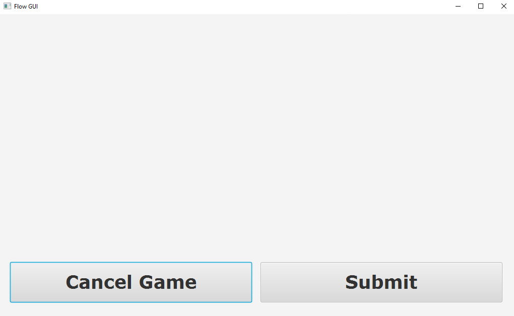
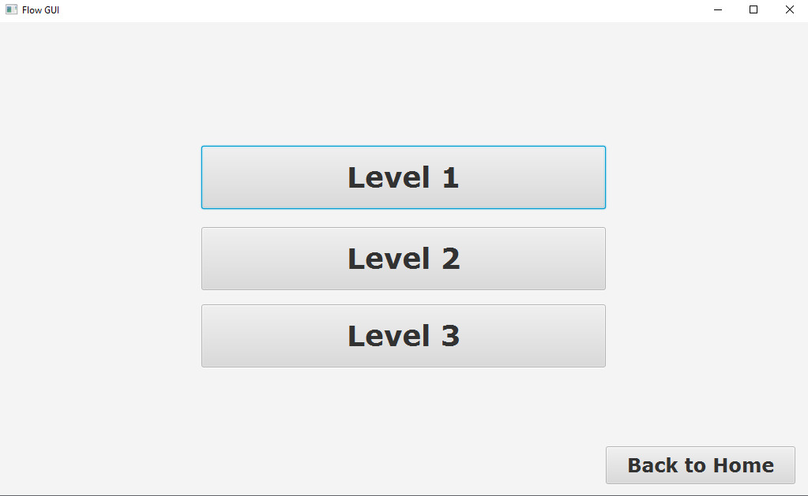
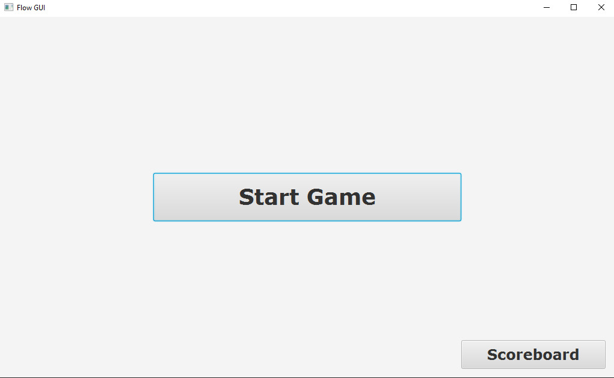
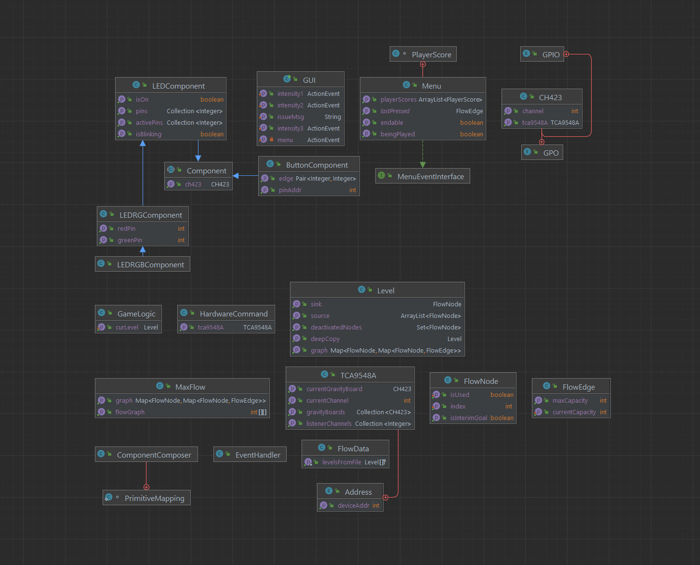
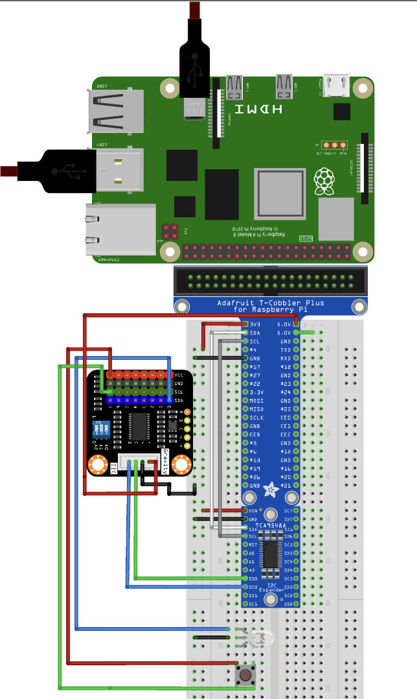

[[section-concepts]]
== Querschnittliche Konzepte
=== Fachliche Konzepte

.Spielprinzip
Das Projekt FLOW basiert auf dem Max-flow Problem und vermittelt den Spielern die Grundlagen der optimalen Verteilung von Strom im Stromnetz. Die Spieler interagieren mit den "Edges" und "Kapazitäten", um die beste Verteilungsmöglichkeit zu finden.

.Spielmechanik
Die Spieler wählen Edges durch das Betätigen von Buttons aus und weisen ihnen Kapazitäten zu. Nodes und Edges sind durch LEDs und LED-Tubes visualisiert. Das Spiel hat zwei Energiequellen (Windrad und Wasserkraftwerk) und ein Ziel (Fabrik).

=== User Experience (UX)

.Benutzerfreundlichkeit
Die Benutzeroberfläche ist intuitiv und ansprechend gestaltet, sodass die Spieler leicht mit den verschiedenen Elementen des Spiels interagieren können. Die LED-Visualisierung hilft dabei, den Status der Nodes und Edges zu verstehen. Die 3D-gedruckten Häuser und Kraftwerke stellen die Problemstellung konkretisierter dar und erhöht somit das Verständnis des Spielers.

.UI des Touch Screen

.Anpassungsfähigkeit
Das Spiel kann an verschiedene Altersgruppen und Bildungsniveaus angepasst werden, indem die Komplexität der Aufgaben und die Anzahl der verfügbaren Ressourcen variiert werden.

=== Sicherheitskonzepte (Safety und Security)

.Elektrische Sicherheit
Das Projekt verwendet sichere elektrische Komponenten und Verkabelung, um Stromschlag- und Brandgefahren zu minimieren. Die Stromversorgung und -verteilung sind so konzipiert, dass sie den geltenden Sicherheitsstandards entsprechen.

.Datenschutz und Datensicherheit:
Da das Projekt hauptsächlich ein physisches Spielbrett ist und keine Benutzerdaten gespeichert werden, sind Datenschutz und Datensicherheit nicht relevant.

=== Unter-der-Haube

.Hardware-Komponenten
Die Hauptkomponenten des Projekts sind der Raspberry Pi 4, TCA9548a, CH423 und Buttons. Sie sind für die Steuerung, Kommunikation und Interaktion der verschiedenen Elemente des Spiels verantwortlich.

.Software
Die Software des Projekts ist in Java geschrieben und verwendet die pi4j-Bibliothek für die Ansteuerung der Hardwarekomponenten. Maven wird für das Deployment der Software eingesetzt.

=== UML Diagramm

Dieses Diagramm visualisiert die Abhängigkeit der verschiedenen Klassen und deren Attribute. Es wurde reduziert, um den Überblick zu vereinfachen

=== Architektur- und Entwurfsmuster

.Systemarchitektur
Das Projekt FLOW ist modular aufgebaut, sodass Hardware- und Softwarekomponenten leicht erweitert werden können.
Um dies sicherzustellen wurde: 

- Gängige Technologien verwendet: RFID, Buttons, LED-Lampen, I2C Bus Communication, I2C Multiplexer, GPO/GPIO Gravity Board.
- Funktonalität abstrahiert und Objekt Orientiert Programmiert.
- Konfiguration in Dateien abgelegt oder leicht änderbar implementiert.

==== Netzwerktopologie
Die Netztopologie ist hierarchisch und sternförmig, wobei der Raspberry Pi 4 im Zentrum steht und die Hardwarekomponenten wie RGB LEDs, GPIO Extender, I2C GPIO Expander und Multiplexer über I2C-Busse und GPIO-Pins verbunden sind. Der Multiplexer ist direkt am Extender des Raspberry Pi4 angebunden und daran erweitert sind die I2c GPIO Expander.

===== Verkabelung der Komponenten
Die Dokumentation der Verkabelung der einzelnen Komponenten steht noch aus und muss erstellt werden. Leider sind in der Fritzing Open-Source-Bibliothek einige Komponenten, die wir in unserem Projekt verwenden, nicht verfügbar. Dazu gehört der CH423. Daher werden wir eine eigene Darstellung der Verkabelung dieser Komponenten erstellen und in die Dokumentation aufnehmen. Zusätzlich ist darauf hinzuweisen, dass das aktuell verfügbare Bild der Verkabelung lediglich eine stark vereinfachte Version der endgültigen Verkabelung darstellt. In der finalen Version werden noch weitere Komponenten und Verkabelungen hinzugefügt, welche dann detailliert dokumentiert werden.

- Dieses Wiring-Diagramm veranschaulicht die Verbindung eines LED- und Button-Paares. Das CH423 Gravity-Board wurde hier durch ein anderes Board des gleichen Herstellers ersetzt. Der einzige Unterschied besteht darin, dass dieses Board ein anderes visuelles Pin-Layout hat. Ausserdem wurden die Kabel direkt angeschlossen.

.Kommunikationsmuster:
Die I2C-Kommunikation ermöglicht den Datenaustausch zwischen den Hardwarekomponenten wie dem Raspberry Pi 4, TCA9548a und CH423. Dieses Kommunikationsprotokoll gewährleistet eine effiziente und zuverlässige Datenübertragung im System.

=== Entwicklungskonzepte

.Implementierungsregeln
Um eine konsistente und qualitativ hochwertige Implementierung zu gewährleisten, sollten Best Practices für Softwareentwicklung und Hardwareintegration angewendet werden

=== Betriebskonzepte
==== Datenmigration
Beschrieben wird folgend der Vorgang, um die Daten des Projekt "FLOW" auf ein neues Medium zu übertragen:

- Projekt Ordner
    * Auf dem Raspberry Pi unter "/opt/flow" finden sie den Projektordner, auf welchem alle notwendige gespeichert sind.
- Log-Dateien
    * Auf dem Raspberry Pi können separat unter "/var/log/flow" gefunden werden, sie sind aber nicht für das Projekt notwendig.
- Relevanten Daten speichern

    * Kopieren auf ein externes Speichermedium:
        ** USB-Stick
            *** Schliessen Sie den USB-Stick an einen verfügbaren USB-Anschluss Ihres Raspberry Pi an.
            *** Öffnen Sie ein Terminalfenster.
            *** Geben Sie lsblk ein, um die Gerätebezeichnung des USB-Sticks zu identifizieren (z.B. "sda1").
            *** Erstellen Sie einen temporären Mount-Punkt für den USB-Stick: sudo mkdir /mnt/usbstick.
            *** Mounten Sie den USB-Stick an den temporären Mount-Punkt: "sudo mount /dev/sda1 /mnt/usbstick" (Ersetzen Sie "sda1" durch die tatsächliche Gerätebezeichnung).
            *** Kopieren Sie den Ordner "opt/flow" auf den USB-Stick: "sudo cp -r /opt/flow /mnt/usbstick/".
            *** Nachdem der Kopiervorgang abgeschlossen ist, unmounten Sie den USB-Stick: "sudo umount /mnt/usbstick".
            *** Entfernen Sie den USB-Stick sicher vom Raspberry Pi.
        ** Externe Festplatte
            *** Schliessen Sie die externe Festplatte an einen verfügbaren USB-Anschluss Ihres Raspberry Pi an.
            *** Öffnen Sie ein Terminalfenster.
            *** Geben Sie "lsblk" ein, um die Gerätebezeichnung der externen Festplatte zu identifizieren (z.B. "sdb1").
            *** Erstellen Sie einen temporären Mount-Punkt für die externe Festplatte: "sudo mkdir /mnt/ext_hdd".
            *** Mounten Sie die externe Festplatte an den temporären Mount-Punkt: "sudo mount /dev/sdb1 /mnt/ext_hdd" (Ersetzen Sie "sdb1" durch die tatsächliche Gerätebezeichnung).
            *** Kopieren Sie den Ordner "opt/flow" auf die externe Festplatte: "sudo cp -r /opt/flow /mnt/ext_hdd/".
            *** Nachdem der Kopiervorgang abgeschlossen ist, unmounten Sie die externe Festplatte: "sudo umount /mnt/ext_hdd".
            *** Entfernen Sie die externe Festplatte sicher vom Raspberry Pi.
--

- Nach erfolgreicher Migration
    * Auf dem neuen System können nun die gesicherten Daten zurück in den entsprechenden Projektordner kopiert werden
    * Validieren Sie die Datenintegrität (Dateiformat und Dateigrösse).
- Nach erfolgreicher Migration der Daten auf das neue System; Import der gesicherten Daten und Validierung der Datenintegrität:
    * JUnit Tests ausführen
    * Hardware-Komponenten überprüfen

.Löschen vorheriger Version
- Stellen Sie sicher, dass alle wichtigen Daten gesichert und migriert wurden.
- Wenn das Projekt auf einem Raspberry Pi ausgeführt wurde, können Sie auch das Betriebssystem neu installieren oder den Speicherplatz mit einem sicheren Löschen-Tool überschreiben, um sicherzustellen, dass keine Datenreste zurückbleiben.
    * Mehr hierzu steht im Kapitel 7 Verteilungssicht unter Vorinstallationen.
- Wenn dies nicht möglich ist, löschen Sie alle Dateien und Ordner, die mit der Installation von FLOW in Verbindung stehen. Dies einschliesslich der Anwendungsdateien, Konfigurationsdateien und Log-Dateien. Dies umfasst:
    * Projektordner:    "/opt/flow"
    * Log Dateien:      "/var/log/flow
--

==== Konfigurierbarkeit

Das "FLOW" Projekt nutzt zwei JSON-Dateien, "edges.json" und "nodes.json", zur Konfiguration der Hardwarekomponenten an den Knoten und Kanten des Graphen. Dies ermöglicht eine flexible Anpassung des Systems an unterschiedliche Hardware-Konfigurationen und Spielmodi.

===== Edges

Die "edges.json" Datei enthält eine Liste von Objekten, die jeweils eine Kante im Graphen repräsentieren. Jedes Objekt enthält folgende Schlüssel:

- "edge": Eine Liste von zwei Zahlen, die die Indizes der verbundenen Knoten in der Graphenstruktur repräsentieren.
- "leds": Eine Liste von Listen, die die Konfiguration der zugehörigen RGB-LEDs repräsentieren. Jede innere Liste enthält vier Zahlen: Den Index der CH423 Gravity Boards und die GPIO-Pins, an denen die Pins des RGB-LED angeschlossen sind. Eine Kante kann mehrere LEDs beinhalten.
- "button": Eine Liste von zwei Zahlen, den Index des CH423 Gravity Boards und den der GPIO-Pin des zugehörigen Buttons.

Um die "edges.json" Datei zu erweitern oder zu ändern, können Sie einfach neue Objekte zur Liste hinzufügen oder bestehende Objekte bearbeiten. Stellen Sie sicher, dass die Indizes und GPIO-Pins korrekt den physischen Verbindungen in Ihrem System entsprechen.

===== Nodes

Die "nodes.json" Datei enthält eine Liste von Listen, die die Knoten im Graphen repräsentieren. Jede Liste enthält:

- Den Index des CH423 Gravity Boards
- Den GPIO-Pin des roten Kabels
- Den GPIO-Pin des grünen Kabels

Um die "nodes.json" Datei zu erweitern oder zu ändern, können Sie einfach neue Listen zur Liste hinzufügen oder bestehende Listen bearbeiten. Stellen Sie sicher, dass der index des CH423 Gravity Boards und die GPIO-Pins korrekt den physischen Verbindungen in Ihrem System entsprechen.

Insgesamt erlaubt diese Struktur eine hohe Konfigurierbarkeit, sowohl in Bezug auf die Hardware-Konfiguration als auch auf die Spiellogik. Änderungen an den JSON-Dateien erlauben es Ihnen, das System schnell und effizient an neue Anforderungen anzupassen.

= Erweiterbarkeit

Die Erweiterbarkeit eines Systems umfasst sowohl Hardware- als auch Softwarekomponenten.

== Anpassungen an der Hardware

In Bezug auf die Hardware sind Anpassungen im Allgemeinen weniger zeitaufwendig. Der Austausch von LEDs und Tasten ist relativ einfach und kann schnell durchgeführt werden. Dies wurde bereits genauer dokumentiert.

link:07_deployment_view.adoc[Informationen zu "Repairability"]

== Anpassungen an der Software

Verglichen mit der Hardware sind Anpassungen auf der Softwareseite oft zeitaufwendiger. Insbesondere bedeutende Änderungen an der Klasse CH423 sind ohne Vorwissen sehr zeitaufwendig. Dies ist vor allem der Fall, wenn die CH423 mit dem i2c Multiplexer tca9854a verwendet wird. Die Änderungen in diesem Bereich erfordern eine beträchtliche Zeitinvestition.

Als Nachschlagewerk für diese Komponenten dient das Datasheet:

https://www.ti.com/lit/ds/symlink/tca9548a.pdf (I2C Multiplexer)

http://www.wch-ic.com/products/CH423.html (Gravity Board / Ch423)

Oberflächliche Anpassung der grafischen Benutzeroberfläche (GUI) sind jedoch meist weniger zeitaufwendig. Dennoch bedarf auch diese Art von Anpassungen einer gewissen Zeitinvestition.

== Anpassbarkeit der Spiellogik

Auch die Spiellogik ist anpassbar. Obwohl dies durchaus machbar ist, erfordert es jedoch eine gewisse Menge an Recherche und Verständnis für das zugrunde liegende System.

////
[role="arc42help"]
****
.Inhalt
Dieser Abschnitt beschreibt übergreifende, prinzipielle Regelungen und Lösungsansätze, die an mehreren Stellen (=_querschnittlich_) relevant sind.

Solche Konzepte betreffen oft mehrere Bausteine.
Dazu können vielerlei Themen gehören, beispielsweise:

* Modelle, insbesondere fachliche Modelle
* Architektur- oder Entwurfsmuster
* Regeln für den konkreten Einsatz von Technologien
* prinzipielle -- meist technische -- Festlegungen übergreifender Art
* Implementierungsregeln

.Motivation
Konzepte bilden die Grundlage für _konzeptionelle Integrität_ (Konsistenz, Homogenität) der Architektur und damit eine wesentliche Grundlage für die innere Qualität Ihrer Systeme.

Manche dieser Themen lassen sich nur schwer als Baustein in der Architektur unterbringen (z.B. das Thema „Sicherheit“).

.Form
Kann vielfältig sein:

* Konzeptpapiere mit beliebiger Gliederung,
* übergreifende Modelle/Szenarien mit Notationen, die Sie auch in den Architektursichten nutzen,
* beispielhafte Implementierung speziell für technische Konzepte,
* Verweise auf „übliche“ Nutzung von Standard-Frameworks (beispielsweise die Nutzung von Hibernate als Object/Relational Mapper).

.Struktur
Eine mögliche (nicht aber notwendige!) Untergliederung dieses Abschnittes könnte wie folgt aussehen (wobei die Zuordnung von Themen zu den Gruppen nicht immer eindeutig ist):

* Fachliche Konzepte
* User Experience (UX)
* Sicherheitskonzepte (Safety und Security)
* Architektur- und Entwurfsmuster
* Unter-der-Haube
* Entwicklungskonzepte
* Betriebskonzepte

image::08-Crosscutting-Concepts-Structure-DE.png["Possible topics for crosscutting concepts"]

.Weiterführende Informationen

Siehe https://docs.arc42.org/section-8/[Querschnittliche Konzepte] in der online-Dokumentation (auf Englisch).

****

=== _<Konzept 1>_

_<Erklärung>_

=== _<Konzept 2>_

_<Erklärung>_

...

=== _<Konzept n>_

_<Erklärung>_
